# Live Orbits - Application Overview

## 🎯 Application Purpose

**Live Orbits** (also known as **Orbit** or **Orbitz ReadAloud Translator**) is a real-time AI-powered multilingual meeting platform that enables seamless communication across language barriers. Participants can speak in their native language and have their speech instantly translated and spoken aloud to other participants in their preferred languages.

## 🏗️ Architecture Overview

### Technology Stack
- **Frontend**: React + TypeScript + Vite
- **Authentication & Database**: Supabase (PostgreSQL + Real-time subscriptions)
- **AI Translation**: Google Gemini 2.5 Flash (Live API with native audio)
- **Speech Recognition**: Web Speech API (browser-native)
- **Speech Synthesis**: Gemini Live API Audio Output
- **Routing**: React Router
- **State Management**: Zustand

### Core Features
1. **User Authentication** (Email/Password via Supabase)
2. **Meeting Management** (Create/Join sessions with UUID-based meeting IDs)
3. **Real-time Speech Translation** (Multi-participant, multi-language)
4. **Video Conferencing UI** (With screen sharing capabilities)
5. **Live Transcript Logging** (Stored in Supabase)
6. **Language Selection** (12+ supported languages)
7. **Audio Feedback Prevention** (Text-only prompts to Gemini)

---

## 📊 Application Flow Diagram


---

## 🗄️ Database Schema

### Supabase Tables

#### 1. **transcripts**
Stores all speech inputs and AI responses for logging and translation processing.

| Column | Type | Description |
|--------|------|-------------|
| `id` | UUID (PK) | Primary key (auto-generated) |
| `type` | TEXT | Type of transcript (e.g., 'live') |
| `source_input` | TEXT | Original user speech text |
| `generated_conversation` | TEXT | AI-generated response/translation |
| `session_id` | TEXT | Meeting session identifier |
| `speaker_id` | TEXT | Unique identifier for the speaker |
| `created_at` | TIMESTAMP | Creation timestamp |
| `metadata` | JSONB | Additional metadata (optional) |

**Indexes:**
- `session_id` (for real-time filtering)
- `created_at` (for chronological queries)

---

#### 2. **transcript_translations**
Tracks translation requests and their status.

| Column | Type | Description |
|--------|------|-------------|
| `id` | UUID (PK) | Primary key (auto-generated) |
| `transcript_id` | UUID (FK) | References `transcripts.id` |
| `target_language` | TEXT | Target language code (e.g., 'es', 'fr') |
| `translated_output` | TEXT | Translated text (filled after processing) |
| `created_at` | TIMESTAMP | Creation timestamp |

**Foreign Keys:**
- `transcript_id` → `transcripts.id`

---

### Database Relationships


---

## 🔄 Meeting & Translation Workflow

This is the **most critical** flow that enables real-time multilingual communication.

### Detailed Translation Pipeline

```mermaid
sequenceDiagram
    actor User1 as User 1 (Spanish)
    participant WebSpeech as Web Speech API
    participant Hook as useWebSpeech Hook
    participant Supabase as Supabase DB
    participant Realtime as Supabase Realtime
    participant Listener as Translation Listener
    participant Gemini as Gemini Live API
    actor User2 as User 2 (English)
    
    Note over User1,User2: Meeting Session: abc-123
    
    %% User 1 speaks
    User1->>WebSpeech: Speaks in Spanish: "Hola, ¿cómo estás?"
    WebSpeech->>Hook: Interim transcription (real-time)
    WebSpeech->>Hook: Final transcription (complete)
    
    %% Save to database
    Hook->>Supabase: INSERT transcripts
    Note right of Supabase: session_id: abc-123<br/>speaker_id: user1-uuid<br/>source_input: "Hola, ¿cómo estás?"<br/>target_language: en
    
    Hook->>Supabase: INSERT transcript_translations
    Note right of Supabase: transcript_id: xyz<br/>target_language: en
    
    %% Real-time propagation
    Supabase->>Realtime: Postgres Change Event
    Note over Realtime: Channel: session_abc-123<br/>Event: INSERT on transcripts
    
    Realtime->>Listener: New transcript detected
    
    %% Filter self-speech
    Listener->>Listener: Check speaker_id
    Note over Listener: speaker_id ≠ user2-uuid<br/>Process translation
    
    %% Build translation prompt
    Listener->>Listener: Build translation prompt
    Note right of Listener: source_lang: auto<br/>target_lang: en<br/>target_locale: en-US<br/>speaker_style: neutral<br/>text: "Hola, ¿cómo estás?"
    
    %% Send to Gemini (TEXT ONLY - no audio)
    Listener->>Gemini: Send TEXT prompt
    Note over Gemini: System Instruction:<br/>Translate naturally<br/>Output speakable text only
    
    %% Gemini processes and responds
    Gemini->>Gemini: Translate to English
    Gemini->>User2: Audio Output: "Hello, how are you?"
    Note over User2: Hears translation in English<br/>with natural speech synthesis
    
    %% Log AI response
    Gemini->>Supabase: Save AI transcript
    Note right of Supabase: source_input: null<br/>generated_conversation: "Hello, how are you?"
```



---

### Key Anti-Feedback Mechanism

**Problem**: Audio feedback loops occur when Gemini's microphone picks up its own output.

**Solution**:
1. **Web Speech API handles ALL audio input** (not Gemini's microphone)
2. **Only TEXT prompts sent to Gemini** (no audio streams)
3. **Supabase acts as intermediary** (decouples speech capture from AI processing)
4. **Speaker ID filtering** (users don't hear their own translations)
5. **Session-based isolation** (translations only within meeting session)

---

### Translation Workflow Steps


---

## 🎤 Audio Processing Architecture

### Speech Input Flow


### Speech Output Flow


---

## 🔧 State Management

### Global State Stores (Zustand)

#### 1. **useSettings**
```typescript
{
  systemPrompt: string       // AI system instruction
  model: string              // Gemini model version
  voice: string              // TTS voice selection
  language: string           // Target translation language
  userId: string             // Unique user identifier
  sessionId: string          // Current meeting ID
}
```

#### 2. **useUI**
```typescript
{
  isSidebarOpen: boolean     // Settings sidebar visibility
}
```

#### 3. **useTools**
```typescript
{
  tools: FunctionCall[]      // Available AI function tools
  template: Template         // Selected tool template
}
```

#### 4. **useLogStore**
```typescript
{
  turns: ConversationTurn[]  // Conversation history
  // Each turn contains: role, text, timestamp, isFinal, toolCalls, etc.
}
```

---

## 🎨 Component Hierarchy


---

## 🌍 Supported Languages

The application supports 12 languages with their specific locales:

| Language | Code | Locale |
|----------|------|--------|
| English | `en` | `en-US` |
| Spanish | `es` | `es-MX` |
| French | `fr` | `fr-FR` |
| German | `de` | `de-DE` |
| Portuguese | `pt` | `pt-BR` |
| Chinese | `zh` | `zh-CN` |
| Japanese | `ja` | `ja-JP` |
| Korean | `ko` | `ko-KR` |
| Hindi | `hi` | `hi-IN` |
| Turkish | `tr` | `tr-TR` |
| Russian | `ru` | `ru-RU` |
| Arabic | `ar` | `ar-SA` |

Each participant can select their preferred language independently, and the system handles multi-directional translations.

---

## 🔒 Security & Authentication

### Authentication Flow


### Session Management
- **Auth Provider**: Supabase Auth
- **Session Storage**: Browser localStorage (automatic)
- **Token Refresh**: Automatic via Supabase client
- **Route Protection**: React Router with conditional redirects

---

## 📦 Key Files & Responsibilities

| File | Purpose |
|------|---------|
| `App.tsx` | Main router with auth-protected routes |
| `components/pages/AuthPage.tsx` | Login/signup interface |
| `components/pages/Dashboard.tsx` | Meeting creation/joining hub |
| `components/pages/MeetingPage.tsx` | Meeting session container |
| `components/orbit/OrbitView.tsx` | Main meeting UI layout |
| `components/orbit/LiveConfig.tsx` | Gemini API configuration & event handling |
| `components/orbit/ControlBar.tsx` | Meeting controls (mic, video, screen share) |
| `lib/supabase.ts` | Supabase client & transcript functions |
| `lib/translation-listener.ts` | Real-time translation subscription hook |
| `hooks/use-web-speech.ts` | Web Speech API integration |
| `lib/state.ts` | Global state management (Zustand) |
| `lib/constants.ts` | Configuration constants |
| `contexts/LiveAPIContext.tsx` | Gemini Live API React context |

---

## 🚀 System Prompt (Translation Instructions)

The AI receives a detailed system prompt that ensures high-quality, natural translations:

**Key Instructions:**
1. **Output ONLY speakable translated text** (no commentary, no markdown)
2. **Preserve sentence alignment** (1-to-1 mapping where possible)
3. **Use native idioms** appropriate for target locale
4. **Mimic speaker style** (pace, emotion, formality from metadata)
5. **Maintain accuracy** (names, numbers, dates unchanged)
6. **Handle disfluencies naturally** (translate "uh", "like", etc. appropriately)
7. **Never imitate specific people** (generic native speaker voice)

**Input Format:**
```
source_lang: auto
target_lang: es
target_locale: es-MX
speaker_style: "neutral, clear"
text: "Hello, how are you today?"
```

**Expected Output:**
```
Hola, ¿cómo estás hoy?
```

---

## 🔄 Real-time Synchronization

### Supabase Realtime Channels

Each meeting session subscribes to a dedicated real-time channel:

```typescript
channel: `session_${meetingId}`
event: 'INSERT'
table: 'transcripts'
filter: `session_id=eq.${meetingId}`
```

**Benefits:**
- Instant propagation to all participants
- Automatic reconnection on network issues
- Filtered by session (no cross-meeting leakage)
- Scalable multi-participant support

---

## 🎯 Translation Quality Features

1. **Locale-Specific Translation**: Uses region-specific dialects (e.g., `es-MX` vs `es-ES`)
2. **Speaker Style Preservation**: Maintains tone, pace, and formality
3. **Context Awareness**: Understands conversation flow
4. **Natural Prosody**: TTS output sounds human-like
5. **Echo Cancellation**: Web Speech API with AEC enabled
6. **Noise Suppression**: Built-in audio preprocessing

---

## 📈 Scalability Considerations

### Current Architecture
- **Single-region Supabase**: May have latency for global users
- **Client-side Speech Recognition**: Offloads processing from servers
- **Session-based isolation**: Prevents cross-contamination

### Potential Optimizations
- Multi-region Supabase deployment
- CDN for static assets
- WebRTC for peer-to-peer video
- Redis caching for frequent translations
- Batch processing for high-traffic sessions

---

## 🛠️ Development Setup

```bash
# Install dependencies
npm install

# Set environment variables in .env.local
VITE_GEMINI_API_KEY=your_gemini_api_key
VITE_SUPABASE_URL=your_supabase_url
VITE_SUPABASE_ANON_KEY=your_supabase_anon_key

# Run development server
npm run dev
```

---

## 📝 Summary

**Live Orbits** is a sophisticated real-time translation platform that combines:
- 🎤 **Browser-native speech recognition** (no server processing)
- 🤖 **AI-powered translation** (Gemini 2.5 Flash)
- 🔊 **Natural speech synthesis** (Gemini audio output)
- ⚡ **Real-time synchronization** (Supabase realtime)
- 🌍 **Multi-language support** (12+ languages)
- 🚫 **Feedback prevention** (text-only AI prompts)
- 📊 **Conversation logging** (full transcript history)

The unique architecture prevents audio feedback loops by using Web Speech API for input and only sending TEXT prompts to Gemini, while Supabase acts as the synchronization layer for multi-participant sessions.

---

## 🔗 Key Integrations

- **Gemini Live API**: Translation + TTS
- **Web Speech API**: STT (Speech-to-Text)
- **Supabase Auth**: User authentication
- **Supabase Database**: Transcript storage
- **Supabase Realtime**: Multi-user sync
- **React Router**: Navigation
- **Zustand**: State management

---

**Last Updated**: December 15, 2025
**Version**: 1.0
**Author**: Live Orbits Team
